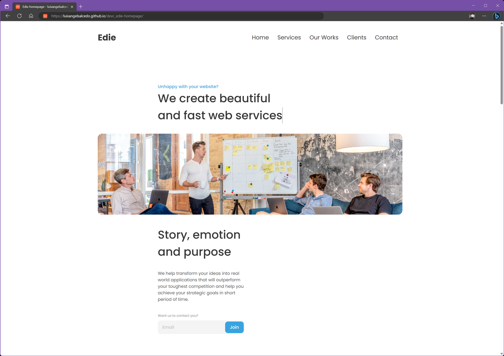

<h1 align="center">Edie homepage</h1>

<div align="center">
   Solution for a challenge from  <a href="http://devchallenges.io" target="_blank">Devchallenges.io</a>.
</div>

<div align="center">
  <h3>
    <a href="https://luisangelsalcedo.github.io/devc_edie-homepage" target="_blank">
      Demo
    </a>
    <span> | </span>
    <a href="https://github.com/luisangelsalcedo/devc_edie-homepage">
      Solution
    </a>
    <span> | </span>
    <a href="https://devchallenges.io/challenges/xobQBuf8zWWmiYMIAZe0">
      Challenge
    </a>
  </h3>
</div>

## Overview



## Built With

<!-- This section should list any major frameworks that you built your project using. Here are a few examples.-->

- [Astro](https://docs.astro.build/en/getting-started/)
- [JavaScript](https://developer.mozilla.org/es/docs/Web/JavaScript)
- [Sass](https://sass-lang.com/)

## How To Use

To clone and run this application, you'll need [Git](https://git-scm.com) and [Node.js](https://nodejs.org/en/download/) (which comes with [npm](http://npmjs.com)) installed on your computer. From your command line:

```bash
# Clone this repository
$ git clone https://github.com/luisangelsalcedo/devc_edie-homepage

# Install dependencies
$ npm install

# Run the app
$ npm run dev
```
